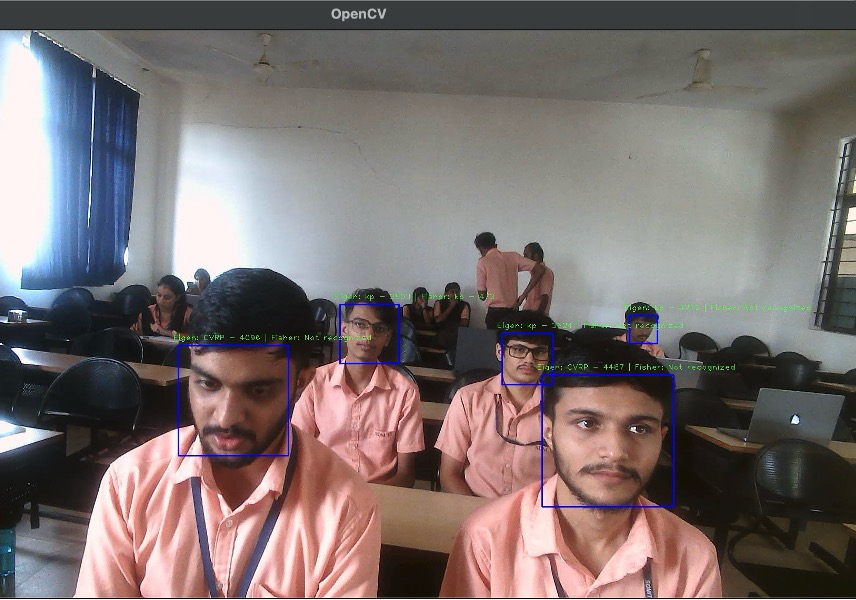
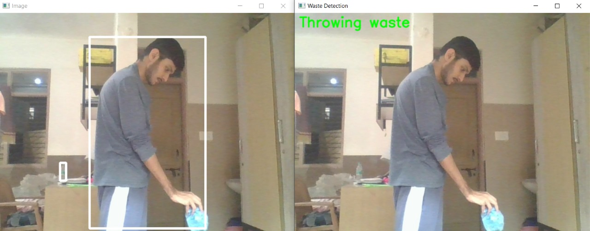
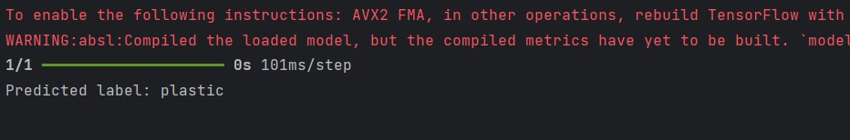
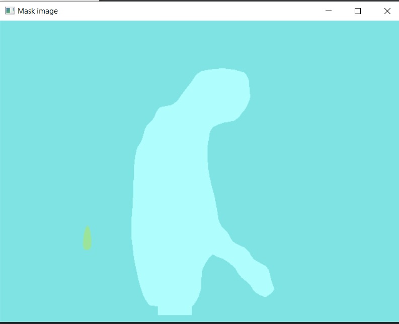
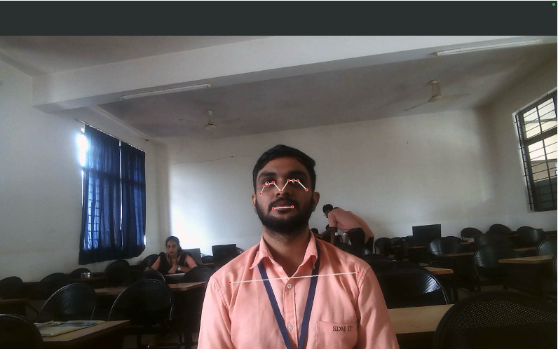
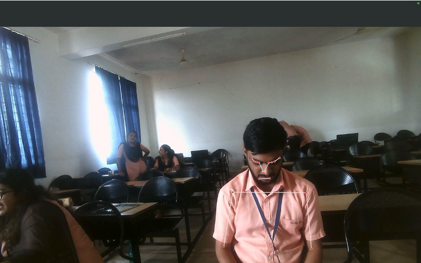

# ALP Intelligence Surveillance

The "ALP Intelligence Surveillance”: Continuous Attendance with Timestamp, Phone
Usage Detection, and Plastic/Waste Litter Detection" project leverages advanced computer
vision techniques and deep learning models to develop an integrated monitoring solution.
This system aims to address three critical areas: continuous attendance monitoring, phone
usage detection, and plastic/waste litter detection. By utilizing OpenCV for image
processing, Mask R-CNN for segmentation tasks and deploying the solution.
The proposed system is designed to continuously monitor and log the attendance of
individuals in a specified area, capturing precise entry and exit timestamps using a facial
recognition framework. This ensures reliable and accurate attendance records.
Concurrently, the system aims to detect phone usage in real-time, leveraging computer
vision techniques to identify when individuals are using their phones. This functionality is
integrated with the attendance monitoring framework to provide comprehensive insights
into individual behavior during monitored sessions.
## Acknowledgements

[1] F. Schroff, D. Kalenichenko, and J. Philbin, "FaceNet: A Unified Embedding for Face
Recognition and Clustering," in Proceedings of the IEEE Conference on
Computer Vision and Pattern Recognition (CVPR), 2015, pp. 815-823.


[2] L. van der Maaten and G. Hinton, "Visualizing Data using t-SNE," Journal of
Machine Learning Research, vol. 9, pp. 2579-2605, 2008.


[3] Google Developers, "Pose Detection and Classifying Poses," Google Developers.
[Online]. Available: https://developers.google.com/ml-kit/vision/pose-
detection/classifying-poses. [Accessed: 23-Jul-2024].


[4] EAI Endorsed Transactions on Industrial Networks and Intelligent Systems, "A Study
on Human Pose Estimation Methods," 7-Dec-2021. [Online]. Available:
https://eudl.eu/pdf/10.4108/eai.7-12-2021.2314723. [Accessed: 23-Jul-2024].


[5] G. Hinton, O. Vinyals, and J. Dean, "Distilling the Knowledge in a Neural Network,"
arXiv preprint arXiv:1503.03832, 2015.


[6] GeeksforGeeks, "ML | One Hot Encoding," GeeksforGeeks. [Online]. Available:
https://www.geeksforgeeks.org/ml-one-hot-encoding/. [Accessed: 23-Jul-2024].


[7] Analytics Vidhya, "A Comprehensive Guide on Human Pose Estimation," Analytics
Vidhya, 13-Jan-2022. [Online]. Available:
https://www.analyticsvidhya.com/blog/202

## Tech Stack

- **Programming Language:**
  - Python

- **Computer Vision:**
  - OpenCV

- **Deep Learning Frameworks:**
  - TensorFlow

- **Model Architectures:**
  - face_recognition
  - real_time_detection
  - Mask R-CNN
  - mediapipe
  
- **Version Control:**
  - Git

- **Deployment:**
  - Shell Scripts

- **Development Tools:**
  - VS Code
  - Jupyter Notebook
  - Pycharm


## Installation and Deployment

    


Follow these steps to set up and run the ALP Intelligence Surveillance system on your local machine.

---

### 1. Prerequisites

Before you begin, ensure you have the following installed:

- **Python 3.8+**

### 2. Clone the Repository

Start by cloning the project repository from GitHub:

```bash
git clone https://github.com/chandan1708/ALP-Intelligence-Surveillance
cd ALP-Intelligence-Surveillance
```

### 3. Set Up a Virtual Environment

It’s recommended to create a virtual environment to manage your dependencies:

```bash
# Create a virtual environment
python -m venv venv

# Activate the virtual environment
# On Windows:
venv\Scripts\activate
# On macOS/Linux:
source venv/bin/activate
```

### 4. Install Dependencies
With the virtual environment activated, install the required Python packages:

```bash
pip install -r requirements.txt
```

This will install all the necessary libraries, including OpenCV, TensorFlow/Keras, and others required for the project.

### 5. Configuration

Configure the project settings:

- **Environment Variables**:
   - Create a `.env` file in the root directory (if not already provided) and set any required  environment variables. For example:
     ```bash
     # Example environment variables
     MODEL_PATH=models/your_model.h5
     CAMERA_INDEX=0 (depends on external Usage)
     ```

- **Model Files**:
   - Ensure that any required pre-trained model files are placed in the `models/` directory or the directory specified in your configuration.

### 6. Running the Application

You can now run the different modules of the project:

- **Attendance Monitoring**:
  ```bash
  python3 python3 attendence_detector.py --camera_index 0
  ```

- **Phone Usage Detection**:
  ```bash
  python3 phone_usage_detector.py --model_path models/phone_detector.h5 --camera_index 0
  ```

- **Plastic/Waste Litter Detection**:
  ```bash
  python3 python3 real_time_detection.py --model_type mask_rcnn --model_path models/waste_detector.h5 --camera_index 0
  ```

### 7. Verifying the Installation

Check that everything is set up correctly:

- Ensure the camera is capturing images and the models are processing them correctly.

### 8. Troubleshooting

If you encounter issues:

- Ensure all dependencies are correctly installed.
- Verify that model paths are correctly set and files are accessible.
- Check that the camera is functioning properly.
- Review the logs for any errors.


## Features

1. **Continuous Attendance Monitoring**
   - Real-time Tracking
   - Facial Recognition
   - Timestamp Logging

2. **Phone Usage Detection**
   - Real-time Detection
   - Behavioral Insights
   - Customizable Alerts

3. **Plastic/Waste Litter Detection**
   - Advanced Segmentation
   - Real-time Alerts
   - Environmental Cleanliness Monitoring

4. **Customizable Camera Integration**
   - Flexible Camera Setup
   - Multi-angle Monitoring
5. **Model Customization**
   - Pre-trained Models
   - Easy Model Integration
6. **User-friendly Interface**
   - Simple Configuration
   - Clear Documentation

7. **Scalable Architecture**
   - Modular Design
   - Lightweight Deployment

## Running Tests

To run tests:
 - Attendance model
```
  python3 attendence_detector.py
```
 - Litter Detection Model
```
 python3 real_time_detection.py
```
 - Phone Usage Detection model
 ```
 python3 phone_usage_detector.py
```
## Screenshots
- Attendence Model


- Litter Detecttion Model




- Phone Usage Model


## Contributing


Contributions are welcome! If you'd like to contribute to this project, please follow these steps:

1. Fork the repository.
2. Create a new branch (`git checkout -b feature/YourFeatureName`).
3. Make your changes.
4. Commit your changes (`git commit -m 'Add some feature'`).
5. Push to the branch (`git push origin feature/YourFeatureName`).
6. Open a pull request.

Please ensure that your code adheres to the project's coding standards and passes all tests. For more detailed information, see the `CONTRIBUTING.md` file.

